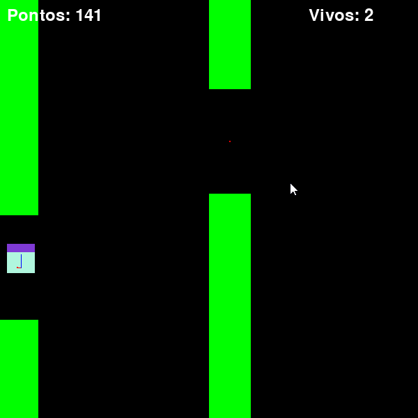
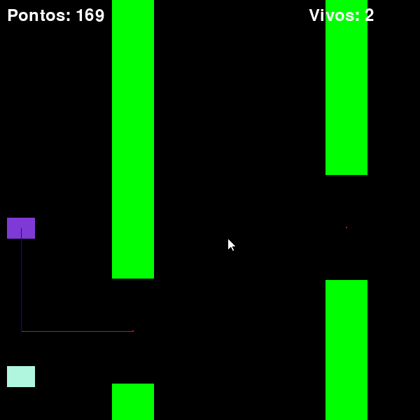
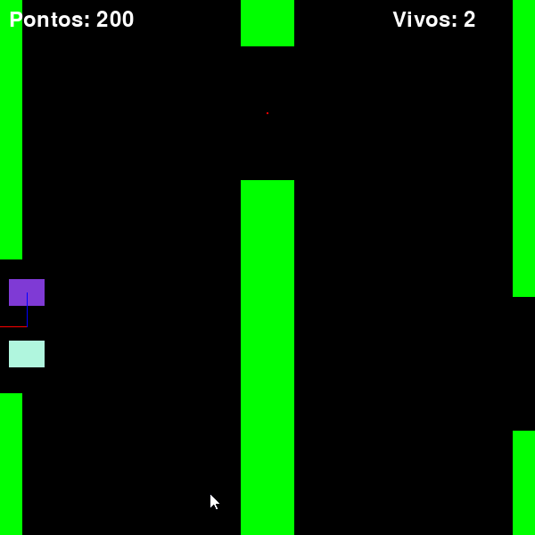

# Rede Neural com Flappy Bird
## Descrição

Neste projeto, desenvolvi um algoritmo de rede neural conhecido como Perceptron Multi-Camadas do zero utilizando python. O objetivo principal foi criar uma estrutura capaz de aprender e tomar decisões em ambientes dinâmicos. Além disso, para demonstrar a eficácia do algoritmo, o integrei a uma cópia simplificada do jogo Flappy Bird.

## Desenvolvimento do Perceptron Multi-Camadas:
O Perceptron Multi-Camadas é uma arquitetura de rede neural artificial composta por múltiplas camadas de neurônios, capaz de aprender padrões complexos nos dados de entrada. No cenário deste projeto, implementei todas as funcionalidades essenciais para a interação e cálculo de saída da rede neural.

# Integração com o Jogo Flappy Bird:
Para testar e demonstrar a capacidade de aprendizado da rede neural, integrei-a a uma versão simplificada do jogo Flappy Bird. Utilizei uma população de 10.000 indivíduos, cada um com pesos iniciais aleatórios. Surpreendentemente, mesmo sem a possíbilidade de melhorias pois ainda não forneci uma método de treinamento para da rede neural, alguns indivíduos demonstraram um desempenho notável, sendo capazes de permanecer vivos por períodos significativos e até mesmo ultrapassar a marca de 200 pontos no jogo.

  
  
  

### Especificações da rede utilizada
   * Uma camada de entrada com 2 neurônios + 1 BIAS, utilizando como entradas os valores de distancia vertical e horizontal do "passáro" até a passagem do cano.
   * Uma camada escondida com 2 neurônios + 1 BIAS
   * Uma camada de saida com 1 neurônio, que caso a saida fosse maior que 1 ativaria o pulo do passáro
   * O algoritmo de ativação dos neurônios é conhecido como Relu

  

## Considerações Finais:
O objetivo princípal desse projeto foi estudar e aprofundar meu conhecimento sobre as redes neurais artificiais, especificamente do Perceptron Multi-Camadas. O próximo passo será implementar um algoritmo de treinamento para melhorar o desempenho, diminuindo o fator probabilístico da aleatoriedade dos pesos para um individuo sobreviver.

A ideia de utilizar o jogo flappy bird, além da base para criação da rede neural foram retirados do seguinte vídeo: [Inteligência Artificial jogando Flappy Bird!!](https://www.youtube.com/watch?v=vavXvu_SMeM&t=6s)
